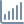
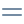
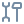

# Shopware 6 Storefront Icons

src: https://github.com/shopware/storefront/tree/trunk/Resources/app/storefront/dist/assets/icon/default

- address 

- alert 

- align-center 

- align-justify 

- align-left 

- align-right 

- arrow-360-left 

- arrow-360-right 

- arrow-circle-down 

- arrow-circle-left 

- arrow-circle-right 

- arrow-circle-up 

- arrow-down 

- arrow-head-down 

- arrow-head-left 

- arrow-head-right 

- arrow-head-up 

- arrow-left 

- arrow-move-horizontal-axis 

- arrow-move-vertical-axis 

- arrow-right 

- arrow-scroll 

- arrow-simple-long-right 

- arrow-switch 

- arrow-turn-left 

- arrow-turn-right 

- arrow-up-down 

- arrow-up 

- avatar-multiple 

- avatar 

- bag-product 

- bag 

- basket 

- beer 

- bell-bell 

- bell-crossed 

- blocked 

- bold 

- bookmark 

- books 

- briefcase 

- browser 

- bug 

- bulk-edit 

- calendar-empty 

- calendar 

- cart 

- chart-bar-filled 

- chart-bar 

- chart-pie 

- chart-sales 

- chart 

- checkmark-block 

- checkmark-circle 

- checkmark 

- checkmark-wide-block 

- checkmark-wide 

- circle-download 

- circle 

- circle-upload 

- clock 

- cloud-download 

- cloud-upload 

- cockpit 

- code 

- colorpicker 

- content 

- dashboard 

- database 

- desktop 

- document-view 

- drag-horizontal 

- drag-vertical 

- duplicate 

- editor-align-left 

- editor-align-right 

- editor-bold 

- editor-code 

- editor-expand 

- editor-italic 

- editor-link 

- editor-list-numberd 

- editor-list 

- editor-list-unordered 

- editor-media 

- editor-redo 

- editor-re-undo 

- editor-shrink 

- editor-strikethrough 

- editor-style 

- editor-subscript 

- editor-superscript 

- editor-table 

- editor-underline 

- editor-undo 2. 

- editor-undo 

- emoji 

- envelope 

- error 

- euro 

- external 

- eye-crossed 

- eye-open 

- file 

- flag 

- folder-thumbnail 

- forward 

- gamecontroler 

- globe 

- gps 

- grab 

- graduate-cap 

- harddisk 

- headset 

- heart 

- help 

- history 

- home 

- hourglass 

- image 

- inbox 

- infinity 

- info 

- italic 

- keyboard 

- lab-flask 

- laptop 

- layers 

- layout 

- lightbulb 

- link 

- list 

- loading-circle 

- loading-star 

- lock-closed 

- lock-fingerprint 

- lock-key 

- lock-open 

- log-in 

- log-out 

- map-closed 

- map-open 

- map 

- marker 

- marketing 

- medal 

- micophone 

- minus-block 

- minus-circle 

- minus 

- minus-wide 

- mobile 

- money-card 

- money-cash 

- money-wallet 

- moon 

- more-horizontal 

- more-vertical 

- move-file 

- package-closed 

- package-gift 

- package-open 

- paint 

- paperclip 

- paper-pencil-signed 

- paper-pencil 

- paperplane 

- pawn 

- pencil-brush 

- photocamera 

- plastic-bag 

- plug 

- plus-block 

- plus-circle 

- plus 

- plus-wide 

- preview 

- printer 

- products 

- pulse 

- pushpin 

- puzzle-piece 

- quickjump 

- quote 

- replace 

- reply 

- rocket 

- ruler-pencil 

- rule 

- save 

- screen-full 

- screen-minimize 

- search 

- server 

- settings 

- share 

- shield 

- shop 

- shopware 

- sidebar-close 

- sidebar-open 

- sliders-horizontal 

- sliders 

- sofa 

- sort-down 

- sort-up 

- speech-bubbles 

- speech-bubble 

- square 

- stack-block 

- stack-circle 

- stack 

- star-half 

- star 

- sun 

- tablet 

- tags 

- target-big 

- target-with-block 

- terminal 

- text-table 

- thumb-down 

- thumb-up 

- tools 

- traffic-pawn 

- trash 

- tray-down 

- tray-up 

- triangle 

- trophy 

- underline 

- variants 

- video-camera 

- view-compact 

- view-grid 

- view-normal 

- view-split 

- warning 

- x-block 

- x-circle 

- x 

- x-wide 

